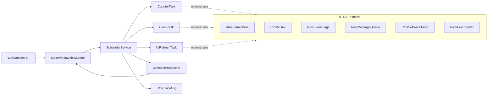
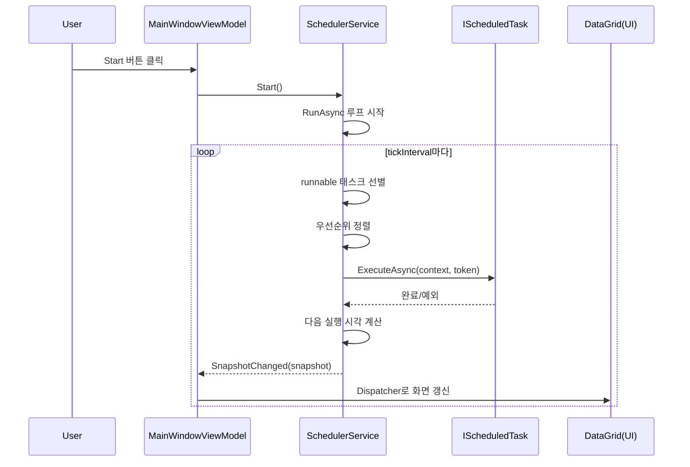
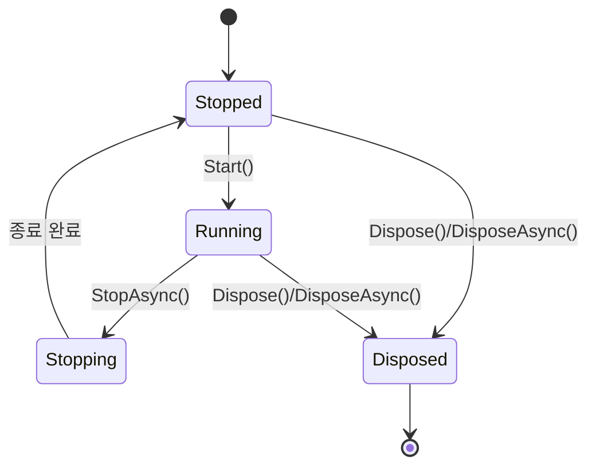

# Wpf.Lib.RTOS 초보자용 완전 가이드

이 문서는 C# 초보자가 현재 프로젝트의 RTOS 스타일 라이브러리를 빠르게 이해할 수 있도록 만든 통합 설명서입니다.

이 라이브러리는 실제 임베디드 RTOS를 그대로 구현한 것이 아니라, WPF 앱에서 다음 기능을 안전하게 연습할 수 있도록 만든 학습/샘플용 구조입니다.

- 주기 실행(Periodic)
- 1회 실행(OneShot)
- 우선순위 기반 실행 순서
- 동기화 primitive(세마포어, 뮤텍스, 이벤트 플래그, 메시지 큐)
- 실행 상태 스냅샷과 통계

---

## 1. 먼저 큰 그림 보기

처음이라면 먼저 아래 빠른 시작을 1회 따라한 뒤 이 문서를 읽는 것을 권장합니다.

- Docs/RTOS_Beginner_Quick_Start.md

전체 구조는 아래처럼 보면 이해가 쉽습니다.

```text
WpfSamples (UI)
  └─ MainWindowViewModel
      ├─ SchedulerService 시작/정지
      ├─ 샘플 태스크 등록
      └─ SnapshotChanged 이벤트로 화면 갱신

Wpf.Lib.RTOS (라이브러리)
  ├─ SchedulerService           // 실행 엔진
  ├─ IScheduledTask             // 태스크 규약
  ├─ SchedulerTaskBase          // 태스크 기본 구현
  ├─ ScheduledTask              // 람다로 만드는 간단 태스크
  ├─ RtosSemaphore              // 세마포어
  ├─ RtosMutex                  // 뮤텍스 + 우선순위 상속 모델
  ├─ RtosEventFlags             // 비트 플래그 기반 이벤트 대기
  ├─ RtosMessageQueue<T>        // 태스크 간 메시지 전달
  ├─ RtosSoftwareTimer          // one-shot/periodic 타이머
  ├─ RtosTickCounter            // tick 계산
  └─ RtosTraceLog               // 실행 로그
```

핵심 포인트는 하나입니다.

- SchedulerService가 태스크들을 "언제" 실행할지 결정한다.
- 태스크는 IScheduledTask 규약을 지켜 "무엇"을 실행할지 제공한다.

---

## 2. 핵심 타입 3개만 먼저 이해하기

### 2-1. IScheduledTask

태스크가 갖춰야 할 최소 약속입니다.

```csharp
public interface IScheduledTask
{
    string Name { get; }
    Enum_TaskPriority Priority { get; }
    TimeSpan Period { get; }
    Enum_TaskExecutionMode Mode { get; }
    Enum_TaskOverrunPolicy OverrunPolicy { get; }

    DateTimeOffset NextRunAt { get; set; }
    bool IsEnabled { get; }

    string Status { get; }
    Task ExecuteAsync(SchedulerContext context, CancellationToken cancellationToken);
    void SetEnabled(bool isEnabled);
}
```

초보자 관점에서는 이렇게 기억하면 됩니다.

- Name: 화면 표시용 이름
- Priority: 동시에 준비된 태스크가 여러 개일 때 순서
- Period: 주기
- Mode: 반복 실행인지, 한 번 실행인지
- ExecuteAsync: 실제 작업 코드

### 2-2. SchedulerTaskBase

IScheduledTask를 직접 매번 구현하기 번거롭기 때문에 기본 구현을 제공하는 추상 클래스입니다.

- NextRunAt, IsEnabled를 lock으로 보호
- SetEnabled 제공
- ExecuteAsync만 자식 클래스에서 구현하면 됨

### 2-3. SchedulerService

실행 엔진입니다.

- Register: 태스크 등록
- Start: 백그라운드 실행 루프 시작
- StopAsync: 종료 요청
- SnapshotChanged: UI에 상태 전달
- SchedulerError: 태스크/핸들러 오류 전달

---

## 3. 스케줄러 실행 흐름 (Start부터 Stop까지)

```text
1) Register(task)
2) Start()
3) RunAsync 루프 진입
4) 실행 가능한 태스크 선별
5) 우선순위 정렬 후 실행
6) 실행 통계 기록
7) 다음 실행 시각 계산
8) Snapshot 발행
9) StopAsync/Dispose 시 종료
```

실행 가능한 태스크 조건:

- IsEnabled == true
- NextRunAt <= 현재 시각

정렬 기준:

- Priority 높은 순
- Priority 같으면 NextRunAt 빠른 순

---

## 4. 실행 정책 이해하기

### 4-1. TaskExecutionMode

- Periodic: 계속 반복
- OneShot: 1회 실행 후 자동 비활성화

현재 구현에서는 OneShot 태스크가 실행되면 SchedulerService가 자동으로 아래를 처리합니다.

- SetEnabled(false)
- NextRunAt = DateTimeOffset.MaxValue

### 4-2. TaskOverrunPolicy

태스크 실행 시간이 period보다 길어진 경우(오버런) 다음 실행 시각 계산 정책입니다.

- FixedRate: 원래 스케줄 기준 시각 + period
- FixedDelay: 완료 시각 + period
- SkipMissedTicks: 놓친 주기를 건너뛰고 다음 가능한 주기로 이동

---

## 5. 상태/통계 데이터는 어떻게 만들어지나

SchedulerService는 태스크마다 TaskRuntimeInfo를 유지합니다.

주요 통계:

- RunCount
- LastStartedAt / LastCompletedAt
- LastDuration / MinDuration / MaxDuration / AverageDuration
- LastStartDelay / MaxStartDelay
- DeadlineMissCount
- LastError

화면으로 보낼 때는 아래 구조로 변환합니다.

- SchedulerSnapshot: 스케줄러 전체 상태
- ScheduledTaskSnapshot: 태스크별 상태

즉 UI는 내부 mutable 객체를 직접 만지지 않고 snapshot만 읽습니다.

---

## 6. 동기화 primitive 쉽게 이해하기

### 6-1. RtosSemaphore

동시에 들어갈 수 있는 개수를 제한합니다.

- WaitAsync(timeout): 자원 획득 시도
- Release(): 반환
- Dispose() 이후 접근 시 ObjectDisposedException

### 6-2. RtosMutex

한 번에 1개 owner만 허용하는 잠금입니다.

- owner 문자열을 추적
- waiting priority를 추적하여 EffectiveOwnerPriority 계산
- IDisposable 구현으로 내부 SemaphoreSlim 정리

주의:

- Release는 현재 owner만 가능

### 6-3. RtosEventFlags

비트 마스크 이벤트 대기 모델입니다.

- WaitAnyAsync: 요청 비트 중 하나라도 set되면 완료
- WaitAllAsync: 요청 비트가 모두 set되어야 완료
- autoClear: 완료 시 해당 비트 자동 clear

현재 구현의 중요한 동작:

- timeout은 TimeoutException
- 외부 cancellation은 OperationCanceledException
- dispose 시 대기 중 waiter는 ObjectDisposedException으로 종료

### 6-4. RtosMessageQueue<T>

태스크 간 데이터 전달 큐입니다.

- SendAsync: 큐가 가득 차면 timeout/cancel 대기
- ReceiveAsync: 큐가 비면 timeout/cancel 대기
- FIFO 보장

### 6-5. RtosSoftwareTimer

Task.Delay 기반 소프트웨어 타이머입니다.

- one-shot/periodic 지원
- TimerError 이벤트로 콜백 오류 보고
- periodic 모드에서 콜백 오류 발생 시 다음 주기 계속 진행
- one-shot 모드에서 콜백 오류 시 종료

### 6-6. RtosTickCounter

시작 시각과 tick interval을 기준으로 tick 값을 계산합니다.

---

## 7. 스레드/동시성 관점에서 꼭 알아둘 점

### 7-1. lock의 역할

- SchedulerService
  - _syncRoot: 태스크 목록/실행정보 보호
  - _stateSyncRoot: 실행 상태 보호
- SchedulerTaskBase
  - NextRunAt, IsEnabled 보호

### 7-2. UI 스레드 규칙

스케줄러는 백그라운드에서 돌기 때문에 WPF UI를 직접 만지면 안 됩니다.

- SchedulerService -> SnapshotChanged 이벤트
- ViewModel -> Dispatcher로 UI 반영

---

## 8. 초보자가 자주 헷갈리는 포인트

### Q1. Period가 10ms면 정확히 10ms마다 실행되나요?

아니요. 운영체제 스케줄링, GC, 태스크 실행 시간 때문에 지연이 생길 수 있습니다.
이 프로젝트는 학습용 RTOS 스타일이며 하드 실시간 보장을 하지 않습니다.

### Q2. OneShot은 왜 NextRunAt을 MaxValue로 두나요?

다시 runnable 후보에 들어가지 않게 하기 위한 간단하고 안전한 방법입니다.

### Q3. StopAsync는 항상 즉시 끝나나요?

아닙니다. 태스크가 cancellation을 관찰하지 않으면 종료가 늦어질 수 있습니다.
그래서 timeout 오버로드를 함께 제공합니다.

### Q4. 태스크 안에서 StopAsync를 호출해도 되나요?

가능하지만 무한대기 교착 위험이 있어 보호 로직이 들어가 있습니다.
스케줄러 실행 컨텍스트에서 무한 타임아웃 Stop 요청은 false를 반환하도록 되어 있습니다.

### Q5. GUI에서 태스크가 어떤 스레드에서 돌았는지 볼 수 있나요?

가능합니다. RTOS Monitor의 DataGrid에 아래 컬럼이 있습니다.

- Start TID: 해당 태스크의 마지막 시작 시점 Managed Thread ID
- Done TID: 해당 태스크의 마지막 완료 시점 Managed Thread ID

참고:
- async/await를 사용한 태스크는 시작/완료 스레드 ID가 다를 수 있습니다.

---

## 9. 코드 읽기 추천 순서

아래 순서대로 보면 이해가 빠릅니다.

1) CommonRTOS.cs (enum)
2) IScheduledTask.cs
3) SchedulerTaskBase.cs
4) SchedulerService.cs
5) TaskRuntimeInfo.cs
6) ScheduledTaskSnapshot.cs / SchedulerSnapshot.cs
7) RtosSemaphore.cs
8) RtosMutex.cs
9) RtosEventFlags.cs
10) RtosMessageQueue.cs
11) RtosSoftwareTimer.cs
12) WpfSamples/Samples_RTOS/*.cs
13) WpfSamples/MainWindowViewModel.cs

---

## 10. 간단한 태스크 작성 예시

```csharp
var task = new ScheduledTask(
    name: "Heartbeat",
    priority: Enum_TaskPriority.Normal,
    period: TimeSpan.FromMilliseconds(500),
    mode: Enum_TaskExecutionMode.Periodic,
    executeAsync: (_, token) =>
    {
        Console.WriteLine("tick");
        return Task.CompletedTask;
    },
    statusProvider: () => "alive",
    overrunPolicy: Enum_TaskOverrunPolicy.FixedDelay);

var scheduler = new SchedulerService();
scheduler.Register(task);
scheduler.Start();
```

---

## 11. 테스트는 어떻게 확인하나

WpfSamples/Tests 안의 RtosTestRunner가 주요 동작을 검증합니다.

현재 테스트 범위(요약):

- Semaphore, MessageQueue, EventFlags 동작
- Mutex owner/우선순위 상속 모델
- SoftwareTimer one-shot/periodic/오류 복원
- Scheduler start/stop/priority/overrun/snapshot/error/trace

테스트를 추가할 때는 다음 2단계를 지키면 됩니다.

1) 테스트 메서드 작성
2) RunAllAsync tests 배열에 등록

---

## 12. 이 라이브러리를 확장할 때 추천 규칙

1) public API 변경 시 먼저 테스트 추가
2) dispose 가능한 타입은 dispose 경로를 반드시 명시
3) timeout과 cancellation은 의미를 분리
4) snapshot은 읽기 전용 데이터로 유지
5) scheduler 내부 lock 구역에서는 오래 걸리는 작업 금지

---

## 13. 한 문장 정리

Wpf.Lib.RTOS는 "태스크 실행 엔진(SchedulerService) + RTOS 스타일 동기화 도구 + 상태 스냅샷"으로 구성된 학습용 라이브러리이며, WPF UI와 백그라운드 실행을 안전하게 연결하는 구조를 연습하기에 좋은 코드베이스입니다.

---

## 14. 시각 자료로 한 번에 이해하기

아래 다이어그램은 "누가 무엇을 호출하고 어떤 데이터가 흘러가는지"를 빠르게 파악하기 위한 그림입니다.

### 14-1. 전체 구성도



### 14-2. Start 이후 실행 순서



### 14-3. Scheduler 상태 전이



---

## 15. 초보자 실습 순서 추천

처음 공부할 때는 아래 순서대로 직접 코드를 열어보면 가장 이해가 빠릅니다.

1. IScheduledTask 읽기: 태스크 약속 확인
2. SchedulerTaskBase 읽기: 공통 구현 이해
3. SchedulerService 읽기: 실행 흐름 파악
4. CounterTask/ClockTask 읽기: 실제 태스크 예시 확인
5. MainWindowViewModel 읽기: UI 연결 방식 이해
6. RtosTestRunner 읽기: 동작 검증 포인트 확인

실습 과제로는 다음 3가지를 추천합니다.

1. 새 Periodic 태스크 하나 추가
2. OverrunPolicy를 바꿔 NextRunAt 변화 비교
3. EventFlags 또는 MessageQueue를 이용한 태스크 간 신호 전달 구현

---

## 16. 다음 단계 문서

동기화 primitive를 더 깊게 학습하려면 아래 문서를 이어서 읽으세요.

- Docs/RTOS_Primitives_Deep_Dive.md
- Docs/RTOS_Simulator_Maturity_Checklist.md
- Docs/RTOS_Real_vs_Simulator_Gap.md

---

## 17. RTOS 함수별 코드 설명 사전

아래는 현재 `Wpf.Lib.RTOS`의 공개 API를 기준으로, 초보자 눈높이에서 각 함수의 역할을 정리한 빠른 참고표입니다.

### 17-1. SchedulerService

- SchedulerService(TimeSpan? tickInterval = null, TimeSpan? snapshotInterval = null)
  - 스케줄러 엔진 생성자입니다.
  - tickInterval은 실행 루프 지연 주기, snapshotInterval은 UI 갱신 이벤트 발행 주기입니다.

- Register(IScheduledTask task)
  - 태스크를 스케줄러에 등록합니다.
  - 중복 등록은 무시되고, 등록 후 즉시 스냅샷이 갱신됩니다.

- Unregister(IScheduledTask task)
  - 등록된 태스크를 제거합니다.
  - 제거 성공 시 true, 없으면 false를 반환합니다.

- Clear()
  - 등록된 태스크와 런타임 통계를 모두 초기화합니다.

- Start()
  - 백그라운드 실행 루프를 시작합니다.
  - 이미 실행 중이면 아무 작업도 하지 않습니다.

- StopAsync()
  - 무한 타임아웃으로 정상 종료를 기다립니다.

- StopAsync(TimeSpan timeout)
  - 지정 시간 내 종료를 시도합니다.
  - 시간 초과 시 false를 반환하고, 내부 정리는 continuation으로 이어집니다.

- Dispose()
  - 동기 dispose 경로입니다.
  - 내부적으로 중지를 시도하고 이벤트 핸들러를 정리합니다.

- DisposeAsync()
  - 비동기 dispose 경로입니다.
  - StopAsync 후 Dispose를 호출해 리소스를 정리합니다.

### 17-2. SchedulerContext

- SchedulerContext(DateTimeOffset now, Func<bool>? shouldYield = null)
  - 태스크 실행 컨텍스트를 생성합니다.
  - now는 현재 스케줄 시각, shouldYield는 협력형 선점 확인 콜백입니다.

- ShouldYield()
  - 현재 태스크가 더 높은 우선순위 태스크에게 양보해야 하는지 확인합니다.
  - true면 태스크 코드가 작업을 쪼개어 빠르게 반환하는 것이 권장됩니다.

### 17-3. IScheduledTask / SchedulerTaskBase / ScheduledTask

- SetEnabled(bool isEnabled)
  - 태스크 활성/비활성 상태를 설정합니다.
  - false면 runnable 후보에서 제외됩니다.

- ExecuteAsync(SchedulerContext context, CancellationToken cancellationToken)
  - 태스크 본문 함수입니다.
  - cancellationToken 관찰을 빠르게 해줘야 StopAsync가 지연되지 않습니다.

- ScheduledTask(...) 생성자
  - 람다 기반 태스크를 빠르게 만드는 도우미 생성자입니다.
  - statusProvider로 UI 상태 문자열을 동적으로 공급할 수 있습니다.

### 17-4. RtosSemaphore

- RtosSemaphore(int initialCount, int maxCount)
  - 세마포어를 생성합니다.
  - initialCount는 시작 토큰 수, maxCount는 최대 토큰 수입니다.

- WaitAsync(TimeSpan timeout, CancellationToken cancellationToken = default)
  - 토큰 획득을 시도합니다.
  - timeout 내 획득 시 true, 실패 시 false를 반환합니다.

- Release()
  - 토큰을 1개 반환합니다.

- Dispose()
  - 내부 SemaphoreSlim을 해제합니다.
  - dispose 후 접근은 ObjectDisposedException이 발생합니다.

### 17-5. RtosMutex

- WaitAsync(string owner, Enum_TaskPriority priority, TimeSpan timeout, CancellationToken cancellationToken = default)
  - owner 이름으로 mutex 획득을 시도합니다.
  - 대기 중인 태스크 우선순위를 추적하여 EffectiveOwnerPriority 계산에 반영합니다.

- Release(string owner)
  - 현재 owner만 mutex를 해제할 수 있습니다.
  - 다른 owner 문자열로 해제하면 SynchronizationLockException이 발생합니다.

- Dispose()
  - 내부 대기 상태를 정리하고 mutex 리소스를 해제합니다.

### 17-6. RtosEventFlags

- Set(uint flags)
  - 지정 비트를 set하고 대기 중 waiter를 평가합니다.

- Clear(uint flags)
  - 지정 비트를 clear합니다.

- WaitAnyAsync(uint flags, bool autoClear, TimeSpan timeout, CancellationToken cancellationToken = default)
  - 요청 비트 중 하나라도 set되면 완료됩니다.
  - 반환값은 실제로 매칭된 비트 마스크입니다.

- WaitAllAsync(uint flags, bool autoClear, TimeSpan timeout, CancellationToken cancellationToken = default)
  - 요청 비트가 모두 set될 때까지 대기합니다.

- Dispose()
  - 대기 중 waiter를 모두 ObjectDisposedException으로 종료시킵니다.

### 17-7. RtosMessageQueue<T>

- RtosMessageQueue(int capacity)
  - 고정 용량 큐를 생성합니다.

- SendAsync(T message, TimeSpan timeout, CancellationToken cancellationToken = default)
  - 큐에 메시지를 넣습니다.
  - 공간이 없으면 timeout/cancel 정책에 따라 대기합니다.

- ReceiveAsync(TimeSpan timeout, CancellationToken cancellationToken = default)
  - 큐에서 메시지를 꺼냅니다.
  - 반환 형식은 (Success, Message) 튜플입니다.

- Dispose()
  - 큐와 내부 세마포어를 정리합니다.

### 17-8. RtosSoftwareTimer

- RtosSoftwareTimer(TimeSpan period, bool isPeriodic, Func<CancellationToken, Task> callback)
  - 소프트웨어 타이머를 생성합니다.
  - isPeriodic=true면 주기 반복, false면 one-shot입니다.

- Start()
  - 타이머 작업을 시작합니다.

- StopAsync()
  - 타이머 취소 후 실행 중 작업 종료를 기다립니다.

- Dispose()
  - 동기 리소스 해제 경로입니다.

- DisposeAsync()
  - 비동기 해제 경로입니다.

- TimerError 이벤트
  - callback 예외를 외부로 보고합니다.
  - periodic 모드에서는 예외가 발생해도 다음 주기를 계속 수행합니다.

### 17-9. RtosTickCounter

- RtosTickCounter(TimeSpan tickInterval)
  - tick 기준 간격을 설정하고 카운터를 생성합니다.

- Reset(DateTimeOffset startedAt)
  - 기준 시각과 현재 tick 값을 초기화합니다.

- AdvanceTo(DateTimeOffset now)
  - 현재 시각으로 tick을 계산해 CurrentTick을 갱신합니다.

- GetTimeForTick(long tick)
  - 특정 tick 번호가 의미하는 실제 시각을 계산합니다.

### 17-10. RtosTraceLog

- RtosTraceLog(int capacity = 512)
  - 로그 버퍼를 생성합니다.
  - capacity를 넘으면 가장 오래된 항목부터 제거됩니다.

- Add(string category, string message, string? taskName = null)
  - 로그 항목을 1개 추가합니다.

- Snapshot()
  - 현재 로그를 읽기 전용 배열로 복사해 반환합니다.

- Clear()
  - 로그를 모두 비웁니다.

---

## 18. 파일별로 어디부터 읽어야 하는지 (초보자용 코드 지도)

아래 순서대로 파일을 열고, 표시된 함수만 먼저 보면 전체 흐름을 빠르게 잡을 수 있습니다.

### 18-1. Scheduler 코어

1) Wpf.Lib.RTOS/SchedulerService.cs
- Start()
- StopAsync(TimeSpan timeout)
- Register(IScheduledTask task)
- RunAsync(...)
- ExecuteTaskAsync(...)

핵심 이해 포인트:
- "어떤 태스크를 고르는지"는 CopyRunnableTasks
- "실행 후 다음 시각 계산"은 ScheduleNextRunIfRegistered
- "UI에 전달할 데이터"는 PublishSnapshot

2) Wpf.Lib.RTOS/IScheduledTask.cs
- ExecuteAsync(...)
- SetEnabled(...)

핵심 이해 포인트:
- 스케줄러가 태스크를 다룰 때 필요한 최소 약속이 무엇인지

3) Wpf.Lib.RTOS/SchedulerTaskBase.cs
- SetEnabled(...)
- NextRunAt(get/set)
- ExecuteAsync(...) (abstract)

핵심 이해 포인트:
- 스레드 안전한 기본 구현이 어떻게 되어 있는지

4) Wpf.Lib.RTOS/SchedulerContext.cs
- ShouldYield()

핵심 이해 포인트:
- 협력형 선점에서 "지금 양보할지"를 태스크가 어떻게 판단하는지

### 18-2. 동기화 primitive

5) Wpf.Lib.RTOS/RtosSemaphore.cs
- WaitAsync(...)
- Release()

핵심 이해 포인트:
- 제한된 자원을 여러 태스크가 나눠 쓰는 기본 패턴

6) Wpf.Lib.RTOS/RtosMutex.cs
- WaitAsync(...)
- Release(string owner)
- EffectiveOwnerPriority

핵심 이해 포인트:
- owner 검증과 우선순위 상속 모델이 어떻게 흉내 나는지

7) Wpf.Lib.RTOS/RtosEventFlags.cs
- Set(uint flags)
- WaitAnyAsync(...)
- WaitAllAsync(...)

핵심 이해 포인트:
- 비트마스크 이벤트 동기화와 autoClear 동작

8) Wpf.Lib.RTOS/RtosMessageQueue.cs
- SendAsync(...)
- ReceiveAsync(...)

핵심 이해 포인트:
- 생산자/소비자 형태 메시지 전달 흐름

### 18-3. 시간/로그/상태 스냅샷

9) Wpf.Lib.RTOS/RtosSoftwareTimer.cs
- Start()
- StopAsync()
- TimerError 이벤트

핵심 이해 포인트:
- periodic vs one-shot, 콜백 예외 처리 정책

10) Wpf.Lib.RTOS/RtosTickCounter.cs
- AdvanceTo(...)
- GetTimeForTick(...)

핵심 이해 포인트:
- tick 기반 시간 모델 계산 방식

11) Wpf.Lib.RTOS/RtosTraceLog.cs
- Add(...)
- Snapshot()

핵심 이해 포인트:
- 고정 길이 로그 버퍼가 왜 필요한지

12) Wpf.Lib.RTOS/SchedulerSnapshot.cs
13) Wpf.Lib.RTOS/ScheduledTaskSnapshot.cs

핵심 이해 포인트:
- UI가 내부 mutable 객체 대신 읽기 전용 snapshot을 쓰는 이유

### 18-4. 읽기 팁 (실전)

1) 함수 시그니처 먼저 보기
- 파라미터와 반환값만 보고 "입력/출력"을 먼저 파악합니다.

2) 예외 조건 먼저 보기
- throw가 있는 조건을 먼저 읽으면 API 사용 규칙이 빠르게 잡힙니다.

3) 마지막에 lock 범위 보기
- 동시성 코드에서 lock 범위가 "상태 일관성 경계"입니다.

4) 샘플 앱과 함께 확인
- WpfSamples/MainWindowViewModel.cs에서 실제 호출 코드를 같이 보면 이해가 2배 빨라집니다.

---

## 19. 초보자가 특히 어려워하는 4개 구간 빠른 해설

### 19-1. SchedulerService.CopyRunnableTasks

헷갈리는 이유:
- lock, 버퍼 복사, 조건 필터, 정렬이 한 메서드에 같이 있어서 복잡해 보입니다.

핵심만 보면:
1. lock 안에서 태스크 목록을 복사한다.
2. lock 밖에서 실행 가능 조건을 검사한다.
3. 우선순위/시각으로 정렬한다.

왜 이렇게 했는가:
- 태스크 속성 getter가 느려도 스케줄러 전체 lock을 오래 잡지 않기 위해서입니다.

### 19-2. SchedulerService.ShouldYieldToHigherPriorityTask

헷갈리는 이유:
- "양보" 조건이 여러 if로 나뉘어 있습니다.

핵심만 보면:
- "나보다 우선순위 높은 태스크"가 "지금 실행 가능"하면 true

태스크 코드에서 의미:
- context.ShouldYield()가 true면 현재 작업을 끊고 return해서 CPU를 양보합니다.

### 19-3. RtosEventFlags.WaitAsync + WaitRequest

헷갈리는 이유:
- timeout, cancellation, dispose를 서로 다르게 처리합니다.

핵심만 보면:
1. 이미 조건 충족이면 즉시 완료
2. 아니면 waiter 등록
3. 이후 완료 원인별로 종료

완료 원인별 결과:
- 정상 매칭: 결과 비트 반환
- timeout: TimeoutException
- cancellation: OperationCanceledException
- dispose: ObjectDisposedException

### 19-4. SchedulerService.ScheduleNextRunIfRegistered

헷갈리는 이유:
- OneShot/Periodic 분기와 overrun 정책 계산이 같이 있습니다.

핵심만 보면:
- OneShot: 1회 실행 후 자동 비활성화
- Periodic: 정책에 따라 다음 실행 시각 계산

정책 차이 한 줄 요약:
- FixedRate: 원래 시각 기준
- FixedDelay: 완료 시각 기준
- SkipMissedTicks: 놓친 주기 건너뛰기

---

## 20. 현재 코드 기준 상세 해설 (2026-05-22)

이 섹션은 지금 프로젝트에 들어있는 실제 코드 흐름을 "한 줄씩 따라가기" 방식으로 설명합니다.

읽는 순서는 아래처럼 추천합니다.

1. SchedulerService.Start
2. SchedulerService.RunAsync
3. SchedulerService.CopyRunnableTasks
4. SchedulerService.ExecuteTaskAsync
5. SchedulerService.ScheduleNextRunIfRegistered
6. MainWindowViewModel.StartPreemptionTestAsync
7. MainWindowViewModel.OnPreemptionUiTimerTick

### 20-1. Start를 누르면 실제로 무슨 일이 벌어지나

흐름을 아주 짧게 줄이면 다음과 같습니다.

1. ViewModel이 SchedulerService.Start를 호출
2. SchedulerService가 CancellationTokenSource 생성
3. Task.Run으로 RunAsync 루프를 백그라운드에서 시작
4. UI는 SnapshotChanged 이벤트만 받아 화면 갱신

중요한 점:
- 태스크 실행은 백그라운드 루프에서 진행
- WPF 컨트롤 접근은 Dispatcher를 통해서만 진행

즉, "실행"과 "표시"가 분리된 구조입니다.

### 20-2. RunAsync 루프는 어떤 순서로 동작하나

RunAsync 한 바퀴를 의사코드로 쓰면 아래와 같습니다.

```csharp
while (!token.IsCancellationRequested)
{
    now = DateTimeOffset.Now;
    runnable = CopyRunnableTasks(now);

    foreach (task in runnable)
    {
        await ExecuteTaskAsync(task, now, token);
    }

    PublishSnapshotIfDue(now);
    await Task.Delay(tickInterval, token);
}
```

초보자 체크포인트:
- runnable 태스크를 매 tick마다 다시 계산합니다.
- 정렬 우선순위는 "Priority 내림차순 -> NextRunAt 오름차순"입니다.
- 예외가 나도 SchedulerError 이벤트로 외부에 보고하고 루프 전체 안정성을 지키는 방향으로 작성되어 있습니다.

### 20-3. CopyRunnableTasks가 lock을 2단계로 쓰는 이유

처음 보면 "그냥 lock 하나로 끝내면 되지 않나?" 싶지만, 의도는 명확합니다.

1단계(lock 안): 등록 목록만 빠르게 복사
2단계(lock 밖): IsEnabled/NextRunAt 조건 계산
3단계(lock 밖): 정렬

왜 좋은가:
- lock 점유 시간을 짧게 유지할 수 있습니다.
- 특정 태스크의 getter가 느려도 스케줄러 전체가 장시간 잠기지 않습니다.

### 20-4. ExecuteTaskAsync에서 꼭 봐야 하는 4개 지점

1. MarkTaskStarted(...)
  - 시작 시각, 스케줄 시각, 시작 스레드 TID 기록

2. await task.ExecuteAsync(...)
  - 실제 사용자 태스크 본문 실행

3. MarkTaskCompleted(...) / MarkTaskFailed(...)
  - 통계(실행시간, 오류, 종료 스레드 TID) 갱신

4. finally에서 ScheduleNextRunIfRegistered(...)
  - 성공/실패와 상관없이 다음 실행 시각 계산

핵심 요약:
- "실행"과 "다음 예약"을 finally로 분리해, 예외가 나도 스케줄러 상태가 무너지지 않게 설계했습니다.

### 20-5. 협력형 선점은 어디서 결정되나

협력형 선점 판단의 중심은 두 군데입니다.

1. SchedulerService.ShouldYieldToHigherPriorityTask
  - "더 높은 우선순위 + 지금 runnable"이면 true

2. 태스크 본문의 context.ShouldYield() 체크
  - true면 작업을 끊고 return하여 CPU를 양보

즉, 강제 선점이 아니라 "태스크가 스스로 양보"하는 모델입니다.

---

## 21. 선점 데모 코드 상세 설명 (UI 스레드 제외 원칙)

최근 변경의 핵심은 다음 한 문장입니다.

- 선점 판단은 RTOS 태스크(LOW/HIGH) 사이에서만 수행하고, WPF UI 스레드는 판정 대상에서 제외한다.

### 21-1. 왜 UI 스레드를 제외해야 하나

WPF UI 스레드는 화면 이벤트 루프를 담당하는 특수 스레드입니다.

이 스레드를 RTOS 선점 판정에 섞으면 아래 오해가 생깁니다.

1. "UI TID가 고정인데 왜 선점이라고 하지?"
2. "UI가 항상 최우선이면 RTOS 선점이 무의미한 것 아닌가?"

그래서 현재 데모는 아래처럼 분리해서 보여줍니다.

1. 현재 실행 TID: RTOS 태스크 실행 스레드
2. 참고 UI TID: 표시만 하되 선점 판정에서는 제외

### 21-2. StartPreemptionTestAsync에서 실제로 하는 일

아래 4단계를 먼저 이해하면 전체가 쉬워집니다.

1. 카운터/로그/트렌드 초기화
2. 데모 전용 SchedulerService 생성
3. LOW 태스크 등록
  - 루프 중 context.ShouldYield()를 주기적으로 검사
  - yield 발생 시 양보 카운트 증가 후 빠르게 return
4. HIGH 태스크 등록
  - 실행 횟수/실행 TID 갱신

그리고 OnPreemptionUiTimerTick에서 아래를 반복합니다.

1. 카운터 값을 화면 속성으로 복사
2. 최근 tick 기반으로 현재 활성 태스크(LOW/HIGH/대기) 판정
3. 인스펙터 카드 색상과 상태 텍스트 갱신

### 21-3. 카드 색상은 어떤 기준으로 바뀌나

UpdatePreemptionInspectorHighlight가 기준입니다.

1. 활성 태스크가 LOW이면 LOW 카드 강조
2. 활성 태스크가 HIGH이면 HIGH 카드 강조
3. 대기/중지면 기본색 복귀
4. 현재 동작 카드는 실행 중 상태일 때만 강조

초보자 팁:
- 색상 로직을 먼저 읽기보다, PreemptionActiveTask가 어디서 바뀌는지 먼저 추적하면 이해가 빠릅니다.

---

## 22. C# 초보자용 코드 읽기 습관 (이 프로젝트에 바로 적용)

아래 5단계 습관만 지켜도 동시성 코드를 훨씬 덜 무섭게 읽을 수 있습니다.

1. public 메서드 시그니처 먼저 읽기
  - 입력/출력/예외를 먼저 파악

2. 상태 필드 찾기
  - 어떤 필드가 lock으로 보호되는지 표시

3. 성공 경로 1번만 따라가기
  - Start -> RunAsync -> ExecuteTaskAsync -> Snapshot 순서로 추적

4. 실패 경로 보기
  - catch에서 어떤 이벤트를 올리고, finally에서 무엇을 복구하는지 확인

5. UI 경계 확인
  - Dispatcher를 통하지 않는 UI 접근이 없는지 체크

실전 체크리스트:

- cancellationToken을 태스크 내부에서 주기적으로 확인하는가?
- timeout과 cancellation을 같은 의미로 처리하지 않았는가?
- dispose 후 객체 접근을 막는가?
- snapshot은 읽기 전용으로 전달되는가?

---

## 23. 초보자용 미니 실습 3개 (현재 코드 그대로 확장)

### 실습 1: Heartbeat 태스크 추가

목표:
- Periodic 태스크를 하나 더 추가하고 RunCount가 증가하는지 확인

할 일:
1. ScheduledTask로 Heartbeat 생성(예: 300ms)
2. statusProvider에서 현재 상태 문자열 반환
3. RTOS Monitor DataGrid에서 RunCount/Start TID 확인

### 실습 2: OverrunPolicy 비교

목표:
- FixedRate, FixedDelay, SkipMissedTicks 차이를 체감

할 일:
1. 의도적으로 120ms 걸리는 태스크 생성
2. period를 50ms로 설정
3. 정책별 NextRunAt 변화와 DeadlineMissCount 비교

### 실습 3: EventFlags로 HIGH 태스크 깨우기

목표:
- 태스크 간 신호 전달과 협력형 양보 흐름 이해

할 일:
1. LOW 태스크가 일정 조건에서 flags.Set(...) 호출
2. HIGH 태스크가 WaitAnyAsync(...)로 대기
3. 깨어난 뒤 빠르게 처리하고 완료 로그 남기기

학습 포인트:
- "대기 -> 신호 -> 실행" 흐름이 보이면 RTOS 동기화의 핵심을 잡은 것입니다.
