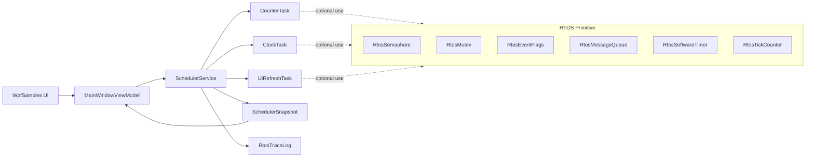
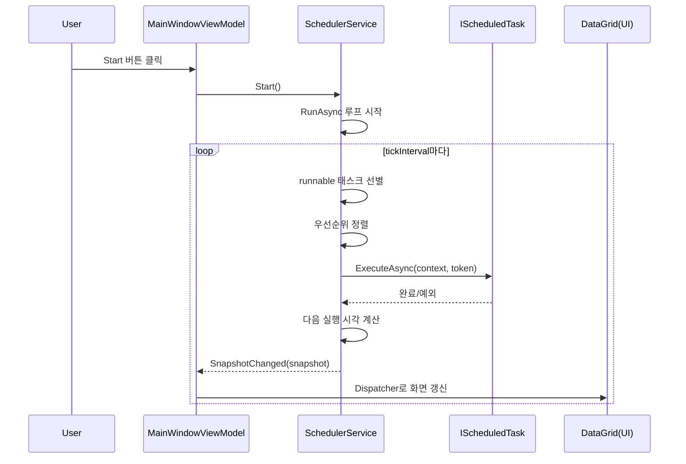
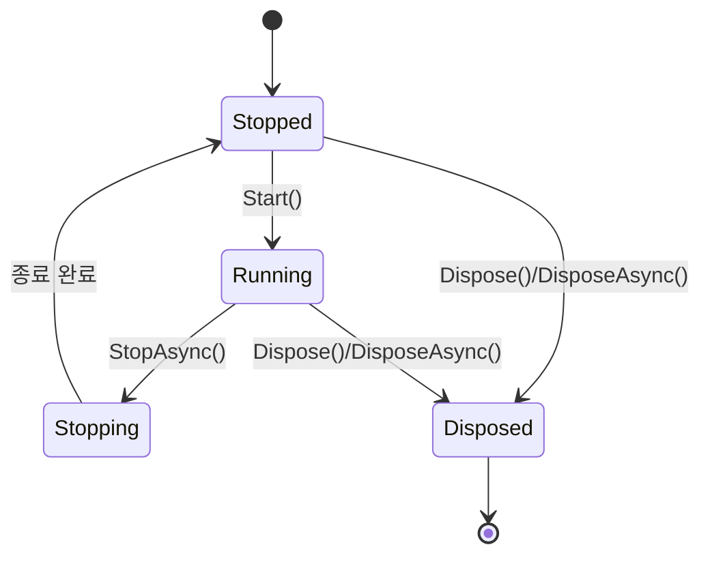

# Wpf.Lib.RTOS 초보자용 완전 가이드

이 문서는 C# 초보자가 현재 프로젝트의 RTOS 스타일 라이브러리를 빠르게 이해할 수 있도록 만든 통합 설명서입니다.

이 라이브러리는 실제 임베디드 RTOS를 그대로 구현한 것이 아니라, WPF 앱에서 다음 기능을 안전하게 연습할 수 있도록 만든 학습/샘플용 구조입니다.

- 주기 실행(Periodic)
- 1회 실행(OneShot)
- 우선순위 기반 실행 순서
- 동기화 primitive(세마포어, 뮤텍스, 이벤트 플래그, 메시지 큐)
- 실행 상태 스냅샷과 통계

---

## 1. 먼저 큰 그림 보기

전체 구조는 아래처럼 보면 이해가 쉽습니다.

```text
WpfSamples (UI)
  └─ MainWindowViewModel
      ├─ SchedulerService 시작/정지
      ├─ 샘플 태스크 등록
      └─ SnapshotChanged 이벤트로 화면 갱신

Wpf.Lib.RTOS (라이브러리)
  ├─ SchedulerService           // 실행 엔진
  ├─ IScheduledTask             // 태스크 규약
  ├─ SchedulerTaskBase          // 태스크 기본 구현
  ├─ ScheduledTask              // 람다로 만드는 간단 태스크
  ├─ RtosSemaphore              // 세마포어
  ├─ RtosMutex                  // 뮤텍스 + 우선순위 상속 모델
  ├─ RtosEventFlags             // 비트 플래그 기반 이벤트 대기
  ├─ RtosMessageQueue<T>        // 태스크 간 메시지 전달
  ├─ RtosSoftwareTimer          // one-shot/periodic 타이머
  ├─ RtosTickCounter            // tick 계산
  └─ RtosTraceLog               // 실행 로그
```

핵심 포인트는 하나입니다.

- SchedulerService가 태스크들을 "언제" 실행할지 결정한다.
- 태스크는 IScheduledTask 규약을 지켜 "무엇"을 실행할지 제공한다.

---

## 2. 핵심 타입 3개만 먼저 이해하기

### 2-1. IScheduledTask

태스크가 갖춰야 할 최소 약속입니다.

```csharp
public interface IScheduledTask
{
    string Name { get; }
    Enum_TaskPriority Priority { get; }
    TimeSpan Period { get; }
    Enum_TaskExecutionMode Mode { get; }
    Enum_TaskOverrunPolicy OverrunPolicy { get; }

    DateTimeOffset NextRunAt { get; set; }
    bool IsEnabled { get; }

    string Status { get; }
    Task ExecuteAsync(SchedulerContext context, CancellationToken cancellationToken);
    void SetEnabled(bool isEnabled);
}
```

초보자 관점에서는 이렇게 기억하면 됩니다.

- Name: 화면 표시용 이름
- Priority: 동시에 준비된 태스크가 여러 개일 때 순서
- Period: 주기
- Mode: 반복 실행인지, 한 번 실행인지
- ExecuteAsync: 실제 작업 코드

### 2-2. SchedulerTaskBase

IScheduledTask를 직접 매번 구현하기 번거롭기 때문에 기본 구현을 제공하는 추상 클래스입니다.

- NextRunAt, IsEnabled를 lock으로 보호
- SetEnabled 제공
- ExecuteAsync만 자식 클래스에서 구현하면 됨

### 2-3. SchedulerService

실행 엔진입니다.

- Register: 태스크 등록
- Start: 백그라운드 실행 루프 시작
- StopAsync: 종료 요청
- SnapshotChanged: UI에 상태 전달
- SchedulerError: 태스크/핸들러 오류 전달

---

## 3. 스케줄러 실행 흐름 (Start부터 Stop까지)

```text
1) Register(task)
2) Start()
3) RunAsync 루프 진입
4) 실행 가능한 태스크 선별
5) 우선순위 정렬 후 실행
6) 실행 통계 기록
7) 다음 실행 시각 계산
8) Snapshot 발행
9) StopAsync/Dispose 시 종료
```

실행 가능한 태스크 조건:

- IsEnabled == true
- NextRunAt <= 현재 시각

정렬 기준:

- Priority 높은 순
- Priority 같으면 NextRunAt 빠른 순

---

## 4. 실행 정책 이해하기

### 4-1. TaskExecutionMode

- Periodic: 계속 반복
- OneShot: 1회 실행 후 자동 비활성화

현재 구현에서는 OneShot 태스크가 실행되면 SchedulerService가 자동으로 아래를 처리합니다.

- SetEnabled(false)
- NextRunAt = DateTimeOffset.MaxValue

### 4-2. TaskOverrunPolicy

태스크 실행 시간이 period보다 길어진 경우(오버런) 다음 실행 시각 계산 정책입니다.

- FixedRate: 원래 스케줄 기준 시각 + period
- FixedDelay: 완료 시각 + period
- SkipMissedTicks: 놓친 주기를 건너뛰고 다음 가능한 주기로 이동

---

## 5. 상태/통계 데이터는 어떻게 만들어지나

SchedulerService는 태스크마다 TaskRuntimeInfo를 유지합니다.

주요 통계:

- RunCount
- LastStartedAt / LastCompletedAt
- LastDuration / MinDuration / MaxDuration / AverageDuration
- LastStartDelay / MaxStartDelay
- DeadlineMissCount
- LastError

화면으로 보낼 때는 아래 구조로 변환합니다.

- SchedulerSnapshot: 스케줄러 전체 상태
- ScheduledTaskSnapshot: 태스크별 상태

즉 UI는 내부 mutable 객체를 직접 만지지 않고 snapshot만 읽습니다.

---

## 6. 동기화 primitive 쉽게 이해하기

### 6-1. RtosSemaphore

동시에 들어갈 수 있는 개수를 제한합니다.

- WaitAsync(timeout): 자원 획득 시도
- Release(): 반환
- Dispose() 이후 접근 시 ObjectDisposedException

### 6-2. RtosMutex

한 번에 1개 owner만 허용하는 잠금입니다.

- owner 문자열을 추적
- waiting priority를 추적하여 EffectiveOwnerPriority 계산
- IDisposable 구현으로 내부 SemaphoreSlim 정리

주의:

- Release는 현재 owner만 가능

### 6-3. RtosEventFlags

비트 마스크 이벤트 대기 모델입니다.

- WaitAnyAsync: 요청 비트 중 하나라도 set되면 완료
- WaitAllAsync: 요청 비트가 모두 set되어야 완료
- autoClear: 완료 시 해당 비트 자동 clear

현재 구현의 중요한 동작:

- timeout은 TimeoutException
- 외부 cancellation은 OperationCanceledException
- dispose 시 대기 중 waiter는 ObjectDisposedException으로 종료

### 6-4. RtosMessageQueue<T>

태스크 간 데이터 전달 큐입니다.

- SendAsync: 큐가 가득 차면 timeout/cancel 대기
- ReceiveAsync: 큐가 비면 timeout/cancel 대기
- FIFO 보장

### 6-5. RtosSoftwareTimer

Task.Delay 기반 소프트웨어 타이머입니다.

- one-shot/periodic 지원
- TimerError 이벤트로 콜백 오류 보고
- periodic 모드에서 콜백 오류 발생 시 다음 주기 계속 진행
- one-shot 모드에서 콜백 오류 시 종료

### 6-6. RtosTickCounter

시작 시각과 tick interval을 기준으로 tick 값을 계산합니다.

---

## 7. 스레드/동시성 관점에서 꼭 알아둘 점

### 7-1. lock의 역할

- SchedulerService
  - _syncRoot: 태스크 목록/실행정보 보호
  - _stateSyncRoot: 실행 상태 보호
- SchedulerTaskBase
  - NextRunAt, IsEnabled 보호

### 7-2. UI 스레드 규칙

스케줄러는 백그라운드에서 돌기 때문에 WPF UI를 직접 만지면 안 됩니다.

- SchedulerService -> SnapshotChanged 이벤트
- ViewModel -> Dispatcher로 UI 반영

---

## 8. 초보자가 자주 헷갈리는 포인트

### Q1. Period가 10ms면 정확히 10ms마다 실행되나요?

아니요. 운영체제 스케줄링, GC, 태스크 실행 시간 때문에 지연이 생길 수 있습니다.
이 프로젝트는 학습용 RTOS 스타일이며 하드 실시간 보장을 하지 않습니다.

### Q2. OneShot은 왜 NextRunAt을 MaxValue로 두나요?

다시 runnable 후보에 들어가지 않게 하기 위한 간단하고 안전한 방법입니다.

### Q3. StopAsync는 항상 즉시 끝나나요?

아닙니다. 태스크가 cancellation을 관찰하지 않으면 종료가 늦어질 수 있습니다.
그래서 timeout 오버로드를 함께 제공합니다.

### Q4. 태스크 안에서 StopAsync를 호출해도 되나요?

가능하지만 무한대기 교착 위험이 있어 보호 로직이 들어가 있습니다.
스케줄러 실행 컨텍스트에서 무한 타임아웃 Stop 요청은 false를 반환하도록 되어 있습니다.

---

## 9. 코드 읽기 추천 순서

아래 순서대로 보면 이해가 빠릅니다.

1) CommonRTOS.cs (enum)
2) IScheduledTask.cs
3) SchedulerTaskBase.cs
4) SchedulerService.cs
5) TaskRuntimeInfo.cs
6) ScheduledTaskSnapshot.cs / SchedulerSnapshot.cs
7) RtosSemaphore.cs
8) RtosMutex.cs
9) RtosEventFlags.cs
10) RtosMessageQueue.cs
11) RtosSoftwareTimer.cs
12) WpfSamples/Samples_RTOS/*.cs
13) WpfSamples/MainWindowViewModel.cs

---

## 10. 간단한 태스크 작성 예시

```csharp
var task = new ScheduledTask(
    name: "Heartbeat",
    priority: Enum_TaskPriority.Normal,
    period: TimeSpan.FromMilliseconds(500),
    mode: Enum_TaskExecutionMode.Periodic,
    executeAsync: (_, token) =>
    {
        Console.WriteLine("tick");
        return Task.CompletedTask;
    },
    statusProvider: () => "alive",
    overrunPolicy: Enum_TaskOverrunPolicy.FixedDelay);

var scheduler = new SchedulerService();
scheduler.Register(task);
scheduler.Start();
```

---

## 11. 테스트는 어떻게 확인하나

WpfSamples/Tests 안의 RtosTestRunner가 주요 동작을 검증합니다.

현재 테스트 범위(요약):

- Semaphore, MessageQueue, EventFlags 동작
- Mutex owner/우선순위 상속 모델
- SoftwareTimer one-shot/periodic/오류 복원
- Scheduler start/stop/priority/overrun/snapshot/error/trace

테스트를 추가할 때는 다음 2단계를 지키면 됩니다.

1) 테스트 메서드 작성
2) RunAllAsync tests 배열에 등록

---

## 12. 이 라이브러리를 확장할 때 추천 규칙

1) public API 변경 시 먼저 테스트 추가
2) dispose 가능한 타입은 dispose 경로를 반드시 명시
3) timeout과 cancellation은 의미를 분리
4) snapshot은 읽기 전용 데이터로 유지
5) scheduler 내부 lock 구역에서는 오래 걸리는 작업 금지

---

## 13. 한 문장 정리

Wpf.Lib.RTOS는 "태스크 실행 엔진(SchedulerService) + RTOS 스타일 동기화 도구 + 상태 스냅샷"으로 구성된 학습용 라이브러리이며, WPF UI와 백그라운드 실행을 안전하게 연결하는 구조를 연습하기에 좋은 코드베이스입니다.

---

## 14. 시각 자료로 한 번에 이해하기

아래 다이어그램은 "누가 무엇을 호출하고 어떤 데이터가 흘러가는지"를 빠르게 파악하기 위한 그림입니다.

### 14-1. 전체 구성도



### 14-2. Start 이후 실행 순서



### 14-3. Scheduler 상태 전이



---

## 15. 초보자 실습 순서 추천

처음 공부할 때는 아래 순서대로 직접 코드를 열어보면 가장 이해가 빠릅니다.

1. IScheduledTask 읽기: 태스크 약속 확인
2. SchedulerTaskBase 읽기: 공통 구현 이해
3. SchedulerService 읽기: 실행 흐름 파악
4. CounterTask/ClockTask 읽기: 실제 태스크 예시 확인
5. MainWindowViewModel 읽기: UI 연결 방식 이해
6. RtosTestRunner 읽기: 동작 검증 포인트 확인

실습 과제로는 다음 3가지를 추천합니다.

1. 새 Periodic 태스크 하나 추가
2. OverrunPolicy를 바꿔 NextRunAt 변화 비교
3. EventFlags 또는 MessageQueue를 이용한 태스크 간 신호 전달 구현

---

## 16. 다음 단계 문서

동기화 primitive를 더 깊게 학습하려면 아래 문서를 이어서 읽으세요.

- Docs/RTOS_Primitives_Deep_Dive.md
